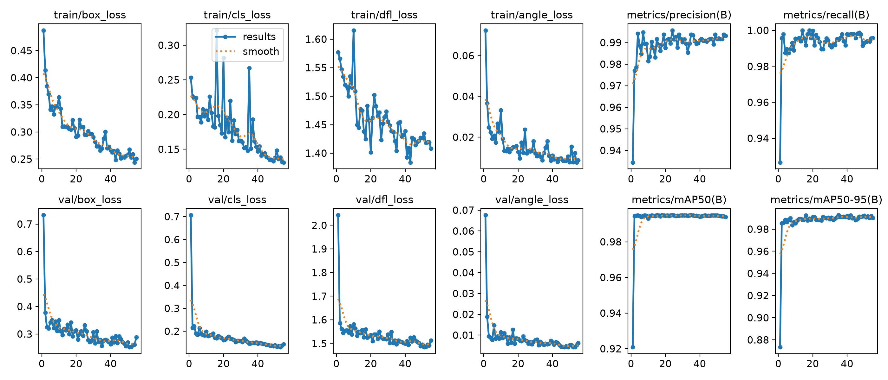
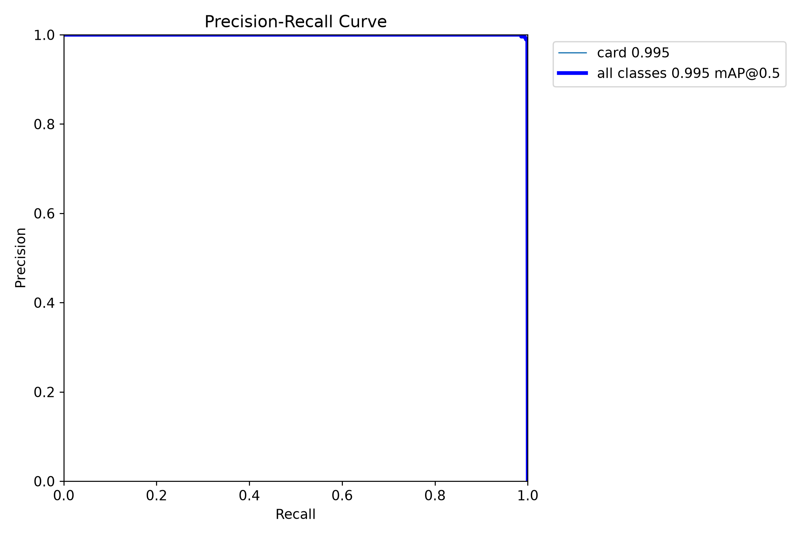
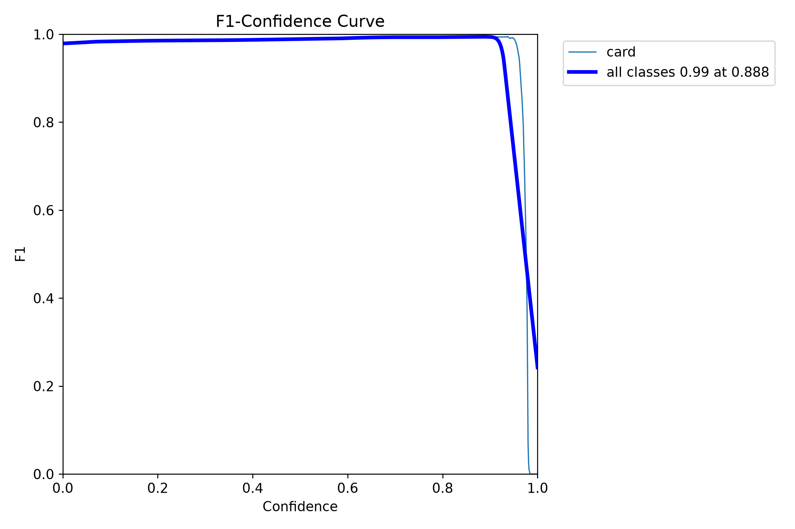
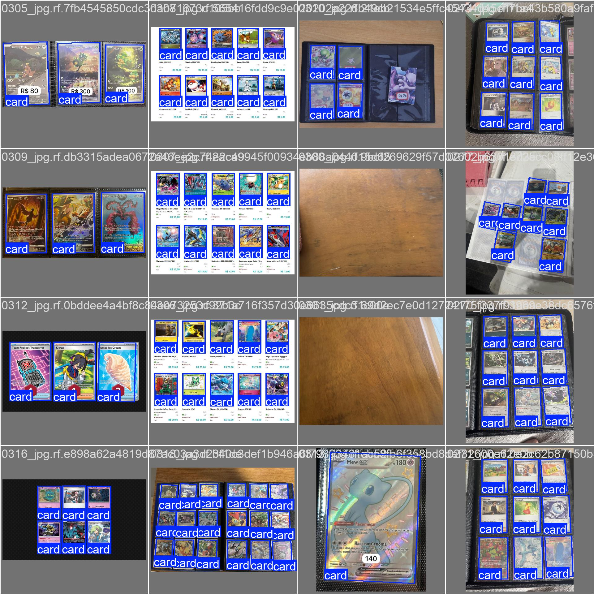
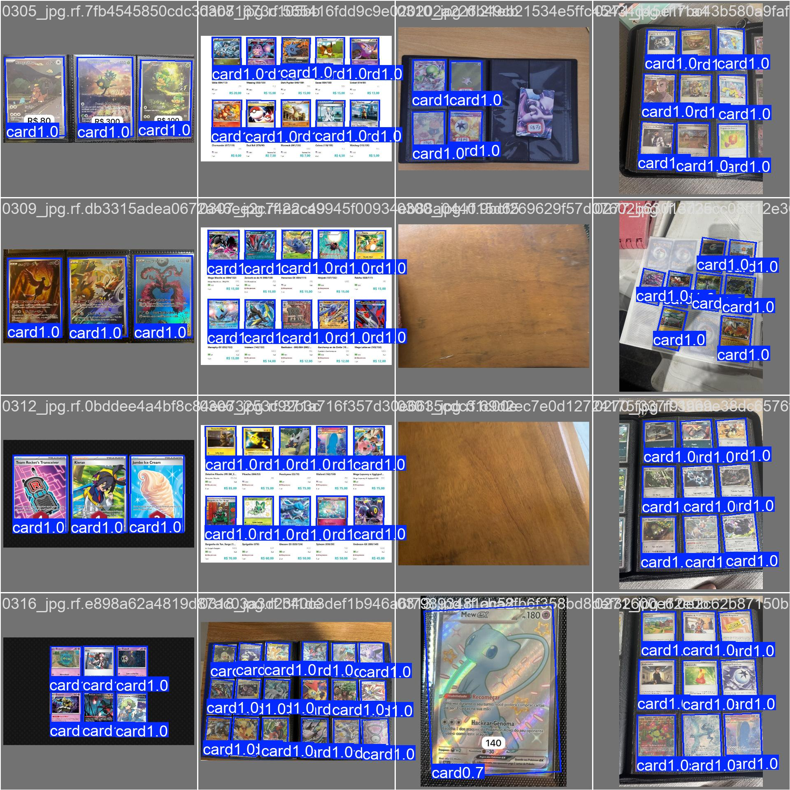

# Detector (YOLOv8 OBB)

Finds each card and estimates box rotation. It does **not** segment pixels and does **not** read the Pokémon name. Rectified crops: [`cropper.md`](cropper.md).

Train in [`notebooks/train_detector.ipynb`](../notebooks/train_detector.ipynb). Official Ultralytics `.pt` files download to [`src/detection/weights/`](../src/detection/weights/README.md). Trained runs: `src/detection/runs/obb/` (gitignored).

The **pipeline** (`notebooks/pipeline.ipynb`) and the cropper CLI use **obb-v6** (`imgsz=960`, `conf=0.8`). Fallback: bundled `obb-v5.pt`, then v4 / v3.

Architecture sweep (v6): [obb-v6](experiments/obb-v6/README.md) · Version swaps: [obb-v3 vs v5](experiments/obb-v3-v5/README.md) · [obb-v2 vs v3](experiments/obb-v2-v3/README.md) · [obb-v1 vs v2](experiments/obb-v1-v2/README.md) (historical).

## Dataset (Roboflow zip, not in Git)

YOLO OBB labels: `class x1 y1 x2 y2 x3 y3 x4 y4`. Project [PTCG Scanner - Detection](https://universe.roboflow.com/pokemon-tcc/ptcg-scanner-detection).

In Roboflow: **Download Dataset → YOLOv8 Oriented Bounding Boxes**. Unzip into `data/detection/` so that folder has `data.yaml`, `train/`, `valid/`, `test/`.

Counts below are from the zip used to train **obb-v5** (native resolution, no stretch). An older v8-era dump in the v3 report had 245 / 75 / 36 images.

| Split | Images | Empty labels (negatives) | `card` instances |
|---|---|---|---|
| Train | 249 | — | 1681 |
| Val | 71 | 6 | 477 |
| Test | 35 | 3 | 255 |
| **Total** | **355** | **9+** | **2413** |

Preprocess: EXIF auto-orient only. **No resize/stretch** and no export-time augmentation. Color and geometry jitter run **only at train time** (see v5).

Label the **printed card edge**, not the binder sleeve. Otherwise OCR inherits pocket/neighbor.

## Training (`obb-v6` sweep)

`VERSION = "v6"`. One model per family (YOLOv26s, YOLOv12n-OBB from yaml, YOLOv8s, RT-DETR-L AABB, YOLOv11s), same v5 augmentation. Cap **300 epochs**, early stop `patience=40`. The notebook **shows val/test plots per family** (sections 4.1–4.5) and elects the winner only in section 5 (mAP50-95, then speed).

Winner: **YOLOv26s-OBB** — val mAP50-95 **0.9938**, test **0.9939**, ~8 ms. Full table: [`experiments/obb-v6/README.md`](experiments/obb-v6/README.md).

Weights: `src/detection/runs/obb/obb-v6/weights/obb-v6.pt`. Pretrained downloads: `src/detection/weights/yolo26s-obb.pt` (etc.).

## Training (`obb-v5`)

In the notebook, `VERSION = "v5"`. Fine-tune from `obb-v3.pt`. Same edge recipe as the unused v4 line (`imgsz=960`, mosaic/erasing off, higher box/DFL/angle, AdamW) **plus** stronger HSV and pose augmentation.

| Item | v3 | v4 (recipe only) | **v5 (production)** |
|---|---|---|---|
| Start checkpoint | `yolov8n-obb.pt` | `obb-v3.pt` | **`obb-v3.pt`** |
| `imgsz` | 800 | 960 | **960** (OOM → 800 or `batch=4`) |
| Mosaic / erasing | 1.0 / 0.10 | 0 / 0 | **0 / 0** |
| HSV h / s / v | 0.015 / 0.7 / 0.4 | 0.01 / 0.5 / 0.3 | **0.02 / 0.7 / 0.5** |
| Rotation / scale / translate | 30° / 0.4 / 0.10 | 15° / 0.3 / 0.05 | **30° / 0.4 / 0.10** + shear 2° |
| Box / DFL / angle | 10 / 2.0 / 1.5 | 12 / 2.5 / 2.0 | **12 / 2.5 / 2.0** |
| Optimizer / LR | auto / 0.01 | AdamW / 0.001 | **AdamW / 0.001** |
| Epochs | 120 (stopped at 99) | 80 (patience 20) | **80** (stopped at **55**, patience 20) |

Mosaic, mixup, copy-paste, random erasing, and perspective stay off: they warp or hide the card rectangle the cropper warps to 63×88 mm.

Weights: `src/detection/runs/obb/obb-v5/weights/obb-v5.pt`. The cropper prefers **obb-v6** when that file exists.

## `obb-v5` results

Val: **71 images / 477 cards** (6 negatives). Test: **35 images / 255 cards** (3 negatives). Train: 55 epochs (~18 min on RTX 5060), `imgsz=960`.

| Metric | Val | Test |
|---|---|---|
| **Precision** | 0.994 | **1.000** |
| **Recall** | 0.995 | 0.992 |
| **F1** | 0.994 | 0.996 |
| **mAP@0.50** | 0.995 | 0.995 |
| **mAP@0.75** | 0.995 | 0.995 |
| **mAP@0.50:0.95** | **0.993** | **0.992** |

Val box matches: **TP 477, FP 13, FN 0**. Last-epoch losses: box 0.289 / cls 0.143 / DFL 1.512 / angle 0.006.

mAP@0.50 and mAP@0.75 both sit at 0.995: the extra augmentation did not loosen the printed edge. Keep `conf=0.8` in the app (F1 peak was ~0.79 on v3; v5 F1 on val is 0.994 at the Ultralytics operating point).

On RTX 5060 (val, 960 px): ~0.6 ms preprocess + ~4.2 ms inference + ~2.3 ms post-process per image.











Confusion-matrix **plots** are not used in the report: with one class `card` the normalized matrix is misleading. TP/FP/FN above are box counts.

## Inference

```python
from ultralytics import YOLO

model = YOLO("src/detection/runs/obb/obb-v5/weights/obb-v5.pt")
results = model.predict("data/detection/test/images", conf=0.8, imgsz=960, save=True)
```

`data/detection/{train,valid,test}/` and `src/detection/runs/` are gitignored. Official checkpoints: [`src/detection/weights/`](../src/detection/weights/README.md). Plots for v5: [`experiments/obb-v5/`](experiments/obb-v5/). Sweep v6: [`experiments/obb-v6/`](experiments/obb-v6/).
