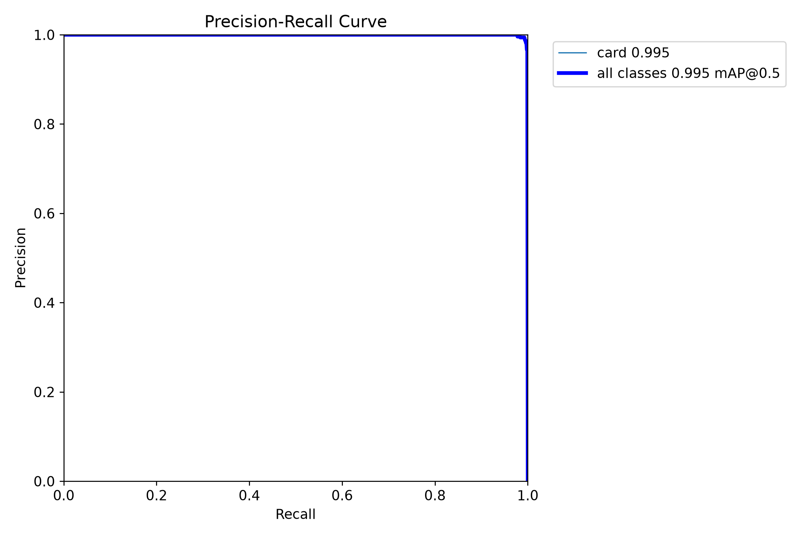
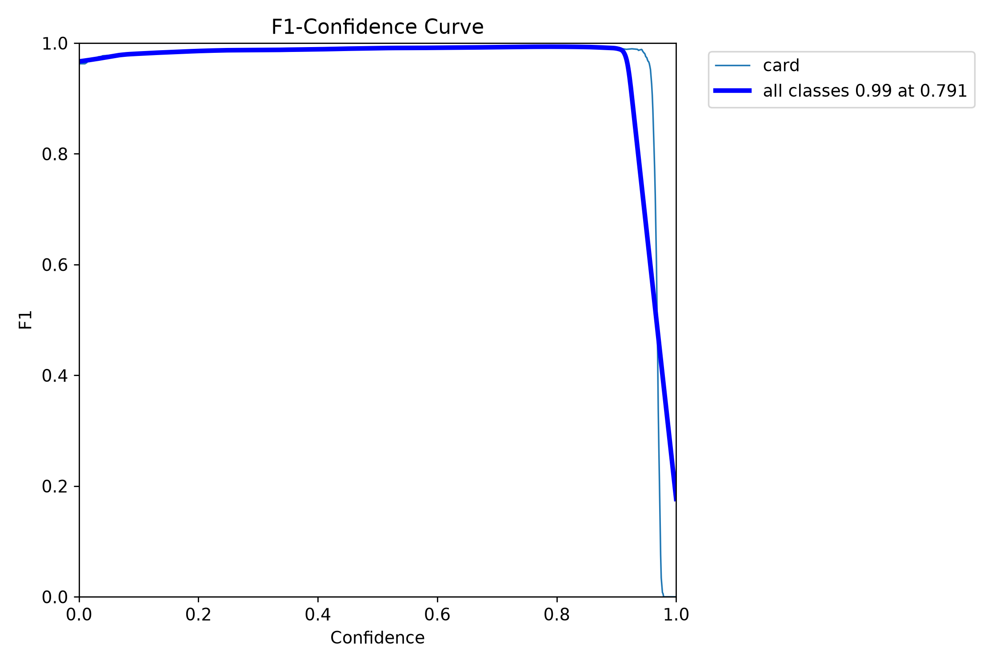
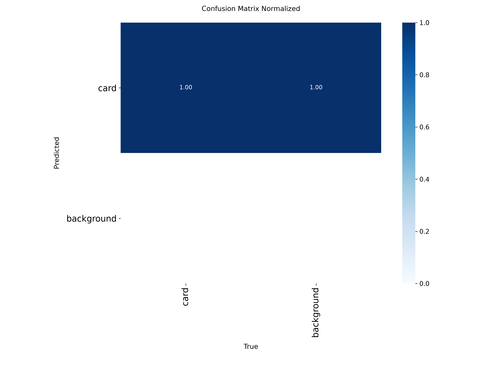
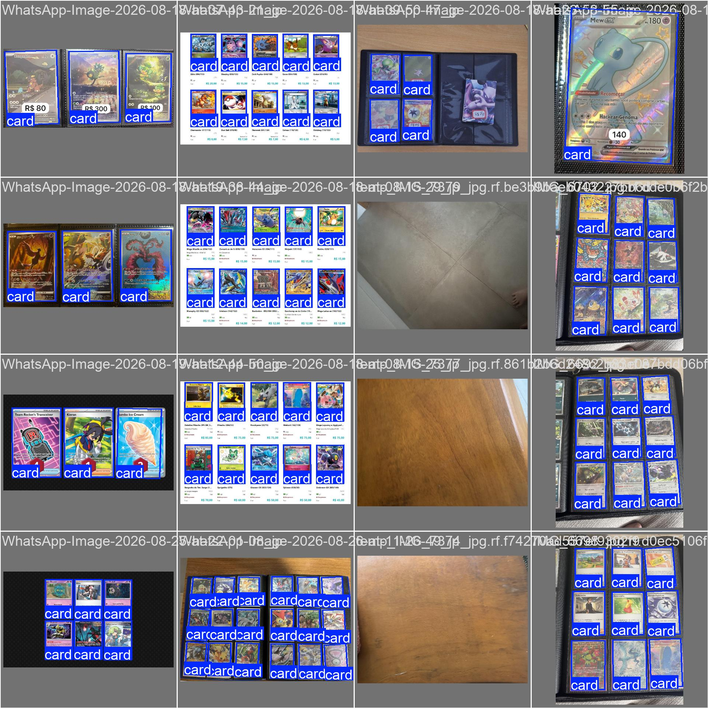

# Detector (YOLOv8 OBB)

Finds each card and estimates box rotation. It does **not** segment pixels and does **not** read the Pokémon name. Rectified crops: [`cropper.md`](cropper.md).

Train in [`notebooks/train_detector.ipynb`](../notebooks/train_detector.ipynb).

Comparisons: [obb-v2 vs v3](experiments/obb-v2-v3/README.md) (current) · [obb-v1 vs v2](experiments/obb-v1-v2/README.md) (historical, stretched dataset).

## Dataset (local, not in Git)

YOLO OBB labels: `class x1 y1 x2 y2 x3 y3 x4 y4`, Roboflow project [Pokemon TCC](https://universe.roboflow.com/pokemon-tcc/pokemon-tcc) **v8**.

Export **YOLOv8 OBB** into `src/detection/dataset/` (`data.yaml`, `train/`, `valid/`, `test/`).

| Split | Images | Empty labels (negatives) | `card` instances |
|---|---|---|---|
| Train | 245 | 19 | 1680 |
| Val | 75 | 8 | 490 |
| Test | 36 | 4 | 255 |
| **Total** | **356** | **31** | **2425** |

Preprocess: EXIF auto-orient only. **No resize/stretch** and no export-time augmentation.

Label the **printed card edge**, not the binder sleeve. Otherwise OCR inherits pocket/neighbor.

## Training (`obb-v4`)

In the notebook, `VERSION = "v4"`. Fine-tune from `obb-v3.pt`. Goal: box tighter on the printed border.

| Item | v3 | **v4 (edges)** |
|---|---|---|
| Start checkpoint | `yolov8n-obb.pt` | **`obb-v3.pt`** |
| `imgsz` | 800 | **960** (OOM → 800 or `batch=4`) |
| Mosaic / erasing | 1.0 / 0.10 | **0 / 0** |
| Box / DFL / angle | 10 / 2.0 / 1.5 | **12 / 2.5 / 2.0** |
| Rotation / scale / translate | 30° / 0.4 / 0.10 | **15° / 0.3 / 0.05** |
| Optimizer / LR | auto / 0.01 | **AdamW / 0.001** |
| Epochs | 120 (stopped at 99) | **80** (patience 20) |

Weights: `src/detection/runs/obb/obb-v4/weights/obb-v4.pt`. Point the cropper at that file (`--weights`).

## `obb-v3` results

Val: **75 images / 490 cards** (8 negatives). Test: **36 images / 255 cards** (4 negatives). Train: 99 epochs (~27 min on RTX 5060), `imgsz=800`.

| Metric | Val | Test |
|---|---|---|
| **Recall** | 0.994 | **1.000** |
| **Precision** | 0.994 | 0.996 |
| **mAP@0.50** | 0.995 | 0.995 |
| **mAP@0.75** | 0.995 | 0.995 |
| **mAP@0.50:0.95** | **0.994** | **0.994** |

Last-epoch losses: box 0.185 / cls 0.123 / DFL 1.132 / angle 0.002.

Train matrix (val): **TP 489, FP 11, FN 1**. F1 curve peaks near conf **0.79** — keep `conf=0.8` in the app.

On RTX 5060: ~4.4 ms inference + ~3.9 ms post-process per image (800 px).






The YOLO confusion matrix **matches boxes**, it does not classify every pixel. Background→background is always 0 because there is no “background” class. Use the **count** matrix plus mAP, not the column-normalized one alone.







## Inference

Use `obb-v4.pt` and `imgsz=960` after v4 training. Until then the cropper falls back to v3 (`imgsz=800`).

```python
from ultralytics import YOLO

model = YOLO("src/detection/runs/obb/obb-v4/weights/obb-v4.pt")
results = model.predict("src/detection/dataset/test/images", conf=0.8, imgsz=960, save=True)
```

`src/detection/dataset/` and `src/detection/runs/` are gitignored.
