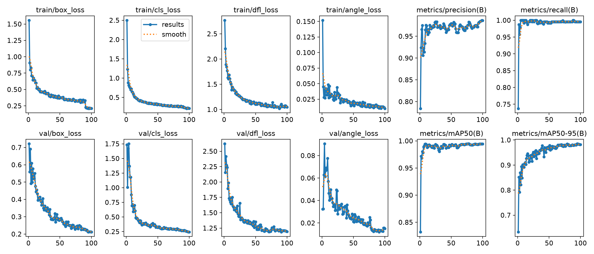
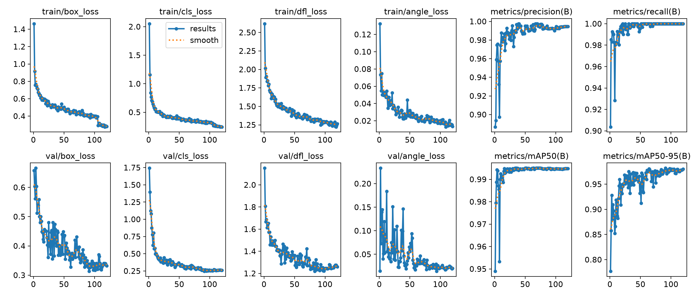
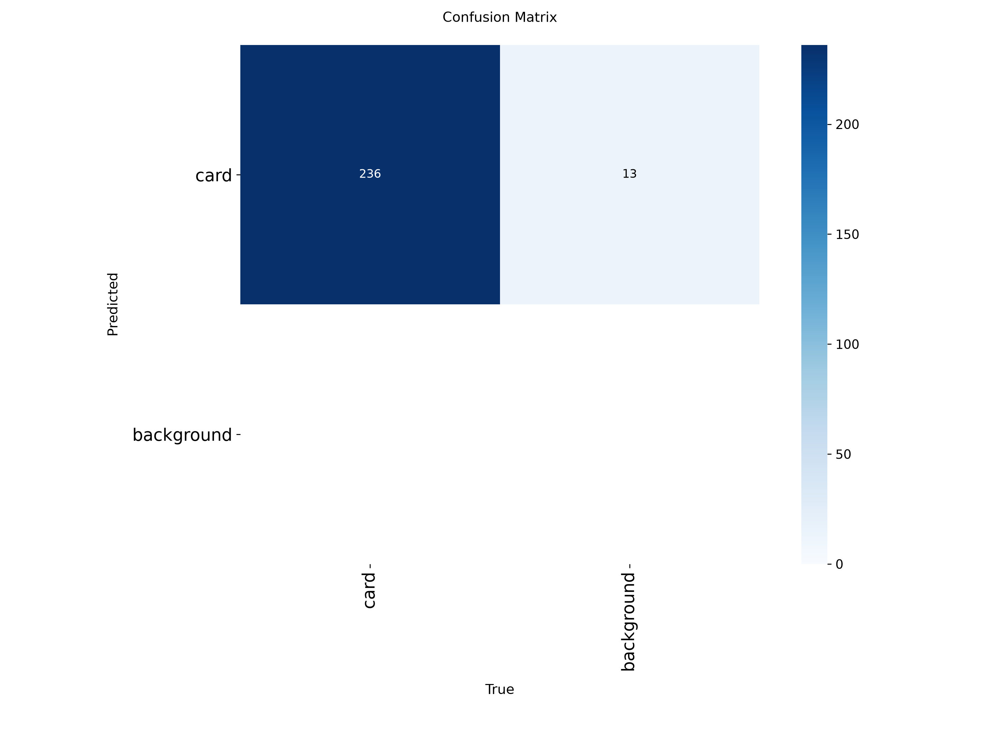
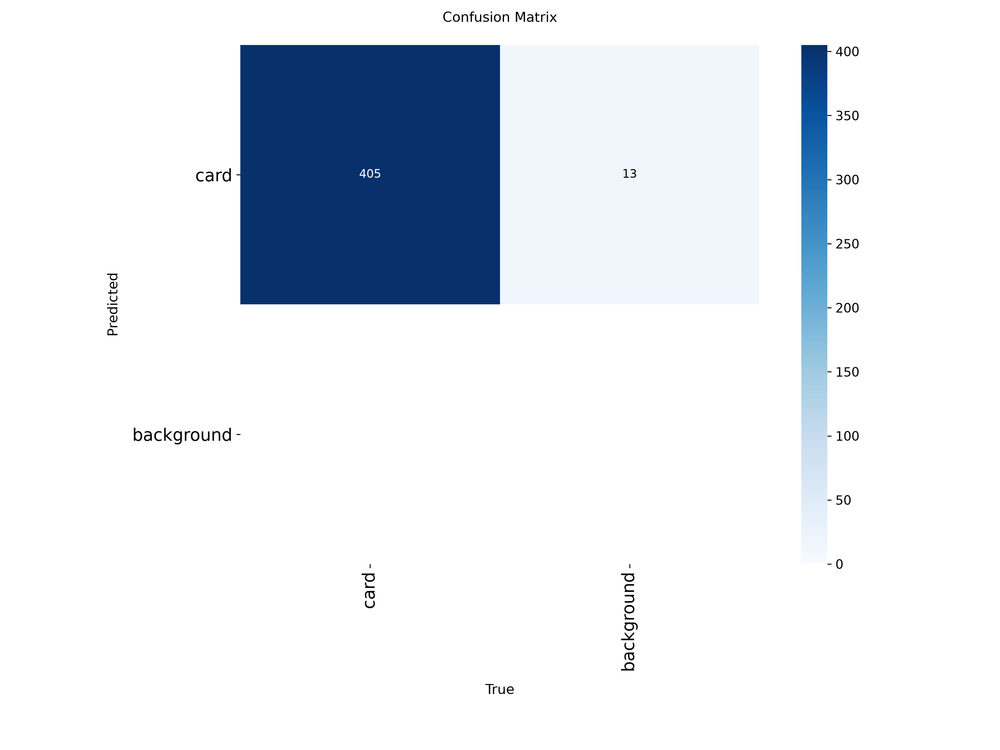
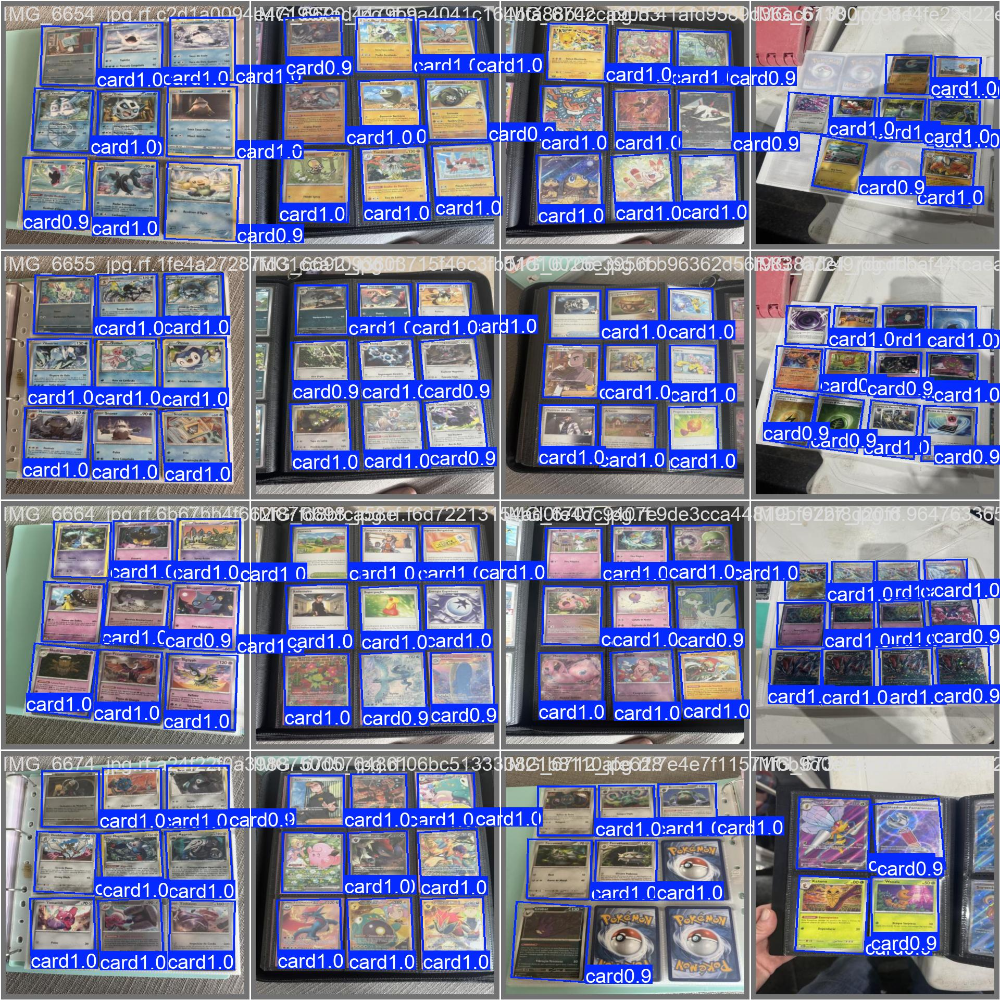

# Comparison `obb-v1` vs `obb-v2`

Historical report on the stretched-512 dataset. The current model in the main docs is **obb-v3** (see [`../obb-v2-v3/README.md`](../obb-v2-v3/README.md)).

Original plots: [`figures/v1/`](figures/v1/) and [`figures/v2/`](figures/v2/).

## What changed

| | **obb-v1** | **obb-v2** |
|---|---|---|
| Roboflow dataset | v5 (~156 images) | v6 (**284** images) |
| Train / val / test | 110 / 31 / 15 | **196 / 59 / 29** |
| `card` instances on val | 236 | **405** |
| Negative images (empty `.txt`) | almost none | 19 train + 8 val + 4 test |
| Architecture | YOLOv8n-OBB | YOLOv8n-OBB (same) |
| Epochs / patience | 100 / 20 | **120 / 30** |
| LR | linear | **cosine** |
| Rotation (`degrees`) | 0 | **45** |
| Vertical flip | 0 | **0.5** |
| Translate / scale / shear | 0.1 / 0.5 / 0 | 0.15 / 0.6 / **5** |
| HSV (h / s / v) | 0.015 / 0.7 / 0.4 | 0.02 / 0.8 / 0.5 |
| Mosaic until | last 10 epochs | last **15** |
| Mixup | 0 | **0.05** |
| Random erase | 0.4 | **0.15** |
| Train time (RTX 5060) | ~5 min | ~11 min |
| Weights | `src/detection/runs/obb/obb-v1/weights/obb-v1.pt` | `src/detection/runs/obb/obb-v2/weights/obb-v2.pt` |

Two kinds of numbers:

1. **Own-run val** — each model on the val split of that run (different sets).
2. **Head-to-head** — both checkpoints on the **then-current** dataset (Roboflow v6).

## 1. Own-run metrics

Do not compare mAP 1:1: v2 val has almost twice the cards **and** empty photos.

| Metric | v1 (v5 val, 31 imgs / 236 cards) | v2 (v6 val, 59 imgs / 405 cards) |
|---|---|---|
| Precision | 0.983 | **0.992** |
| Recall | 0.996 | **1.000** |
| mAP@0.50 | 0.994 | **0.995** |
| mAP@0.50:0.95 | ~0.93–0.98 | **0.983** |

### Curves

### Confusion matrix (counts)

Background→background is always 0 (no “background” objects). Use the **count** matrix; the normalized one paints the background column dark (FP/FP = 1.00) and misleads.

### Val predictions

## 2. Head-to-head on the v6 dataset

Same `dataset/data.yaml`. v1 was **not** trained on this larger set; v2 was.

**Val — 59 images, 405 cards, 8 empty**

| | Precision | Recall | mAP50 | mAP75 | mAP50-95 |
|---|---|---|---|---|---|
| obb-v1 | 0.983 | 0.995 | 0.994 | 0.994 | **0.983** |
| obb-v2 | **0.992** | **1.000** | **0.995** | **0.995** | 0.983 |

**Test — 29 images, 204 cards, 4 empty**

| | Precision | Recall | mAP50 | mAP50-95 |
|---|---|---|---|---|
| obb-v1 | 0.990 | 0.994 | 0.994 | **0.987** |
| obb-v2 | **0.992** | **1.000** | 0.994 | 0.978 |

Speed on RTX 5060 (val, 640 px): v1 ~2.6 ms inference + 3.9 ms post; v2 ~2.0 ms + 2.6 ms. Not a reason to pick a checkpoint.

## Conclusion (historical)

At that point the working detector was **obb-v2**: perfect recall on then-current val/test, slightly better precision, trained with denser pages and negatives. v1’s slightly higher test mAP50-95 (0.987 vs 0.978) is noise on 29 images.

The later **obb-v3** (native resolution, no stretch) superseded both — see [obb-v2 vs v3](../obb-v2-v3/README.md).
