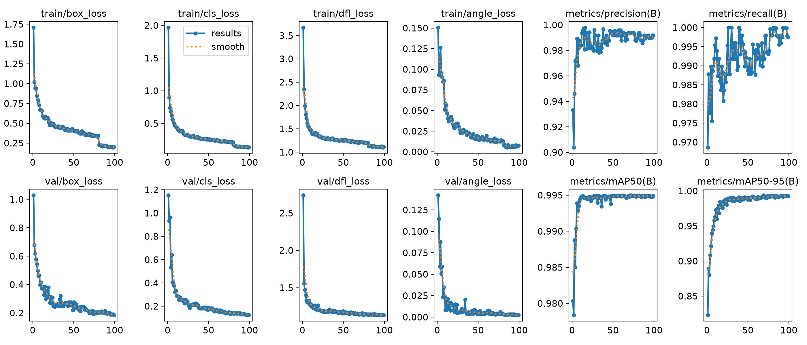
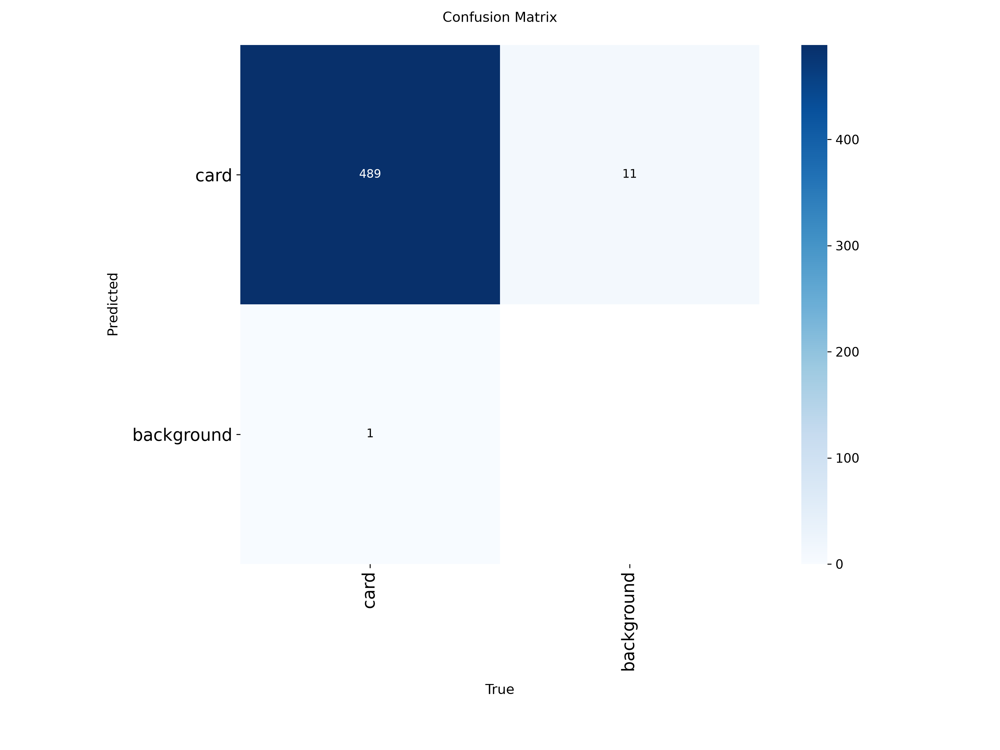
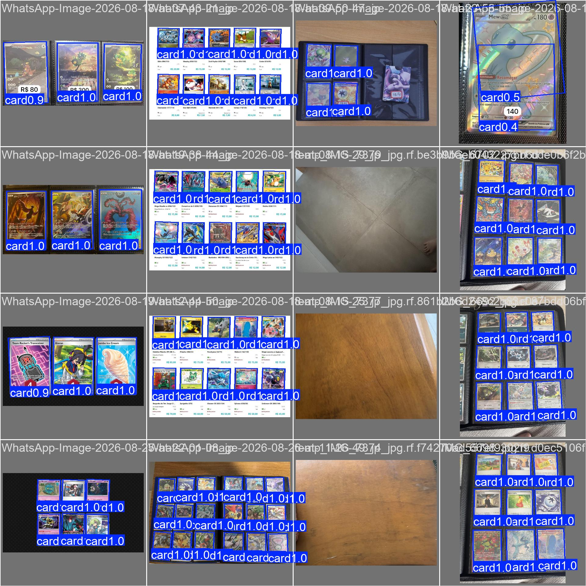

# Comparison `obb-v2` vs `obb-v3`

Historical dataset/geometry change. Production today is **obb-v5** — see [`../obb-v3-v5/README.md`](../obb-v3-v5/README.md).

Plots: [`figures/v2/`](figures/v2/) and [`figures/v3/`](figures/v3/).  
Older stretch-dataset comparison: [`../obb-v1-v2/README.md`](../obb-v1-v2/README.md).

v3 aimed at a **tighter printed edge** (mAP50-95 / DFL / angle), not at finding more cards. v2 already had recall ~1 on the old set.

## What changed

| | **obb-v2** | **obb-v3** |
|---|---|---|
| Roboflow dataset | v6 (284 images, stretch 512) | **v8 (356 images, no resize)** |
| Train / val / test | 196 / 59 / 29 | **245 / 75 / 36** |
| `card` instances | 1459 / 405 / 204 | **1680 / 490 / 255** |
| Negatives | 19 + 8 + 4 | 19 + 8 + 4 |
| Preprocess | stretch 512×512 | **EXIF auto-orient only** |
| `imgsz` | 640 | **800** |
| Box / DFL / angle | 7.5 / 1.5 / 1.0 | **10 / 2.0 / 1.5** |
| Rotation / scale / shear | 45° / 0.6 / 5 | **30° / 0.4 / 0** |
| Mixup | 0.05 | **0** |
| Mosaic off | last 15 epochs | **last 40** |
| Epochs run | 120 / 120 | **99 / 120** (early stop, patience 30) |
| Time (RTX 5060) | ~11 min | ~27 min |
| Weights | `src/detection/runs/obb/obb-v2/weights/obb-v2.pt` | `src/detection/runs/obb/obb-v3/weights/obb-v3.pt` |

Two kinds of numbers:

1. **Own-run val** — each model on the val set of that run (stretch vs native).
2. **Head-to-head** — both checkpoints on the **current** dataset (Roboflow v8, no stretch).

## 1. Own-run metrics

Do not compare mAP 1:1: v3 val has more cards and native geometry.

| Metric | v2 (v6 stretch val, 59 imgs / 405 cards) | v3 (v8 native val, 75 imgs / 490 cards) |
|---|---|---|
| Precision | 0.992 | **0.994** |
| Recall | **1.000** | 0.994 |
| mAP@0.50 | 0.995 | 0.995 |
| mAP@0.75 | 0.995 | **0.995** |
| **mAP@0.50:0.95** | 0.983 | **0.994** |
| Matrix TP / FP / FN | 405 / 13 / 0 | **489 / 11 / 1** |
| Val box / cls / DFL / angle | 0.332 / 0.260 / 1.260 / 0.020 | **0.185 / 0.123 / 1.132 / 0.002** |
| Best epoch (mAP50-95) | 91 (0.982) | 69 (0.994) |
| Peak F1 | 1.00 @ 0.842 | 0.99 @ **0.791** |

The edge-quality jump is **mAP50-95** (0.983 → 0.994) plus box/angle losses.

### Curves

**v2 (120 epochs, mosaic until 105)**

**v3 (99 epochs, mosaic until 80; early stop)**

On v3 the step near epoch 80 is `close_mosaic`. `best.pt` is epoch 69 (still with mosaic); epoch 99 mAP50-95 is almost the same (0.993 vs 0.994).

### Confusion matrix (counts)

**v2** — TP 405, FP 13, FN 0

**v3** — TP 489, FP 11, FN 1

Background→background stays 0. Use counts, not the normalized matrix.

### Val predictions

**v2**

**v3**

## 2. Head-to-head on the current dataset (v8, no stretch)

Same `dataset/data.yaml`. Each model at the `imgsz` it was trained with (640 vs 800). v2 never saw this native export.

**Val — 75 images, 490 cards, 8 empty**

| | Precision | Recall | mAP50 | mAP75 | **mAP50-95** |
|---|---|---|---|---|---|
| obb-v2 @640 | 0.976 | 0.955 | 0.984 | 0.967 | 0.934 |
| obb-v3 @800 | **0.994** | **0.994** | **0.995** | **0.995** | **0.994** |

**Test — 36 images, 255 cards, 4 empty**

| | Precision | Recall | mAP50 | mAP75 | **mAP50-95** |
|---|---|---|---|---|---|
| obb-v2 @640 | 0.984 | 0.952 | 0.990 | 0.978 | 0.938 |
| obb-v3 @800 | **0.996** | **1.000** | **0.995** | **0.995** | **0.994** |

v2 looks worse here because it trained on cards **stretched to 512 px**. That is not a regression on the old set; it is a geometry mismatch. mAP50-95 0.934 vs 0.994 is the slack on the edge.

Speed on RTX 5060 (val): v2 ~3.7 ms inference; v3 ~4.4 ms @800. Not a reason to pick a checkpoint.

## Conclusion

**On that native dataset, use obb-v3 rather than v2.** Production after that is **obb-v5** ([v3 vs v5](../obb-v3-v5/README.md)).

- Edge: mAP50-95 goes from ~0.98 (old v2 val) / ~0.93 (v2 on the new set) to **0.994**.
- Current test: recall 1.0 and precision 0.996.
- App inference: `conf=0.8` is still appropriate (F1 peak at 0.79).

Most of the gain is **dropping stretch + `imgsz=800`**, with extra help from box/DFL and a shorter mosaic tail. Do not go back to v2 on this dataset.
